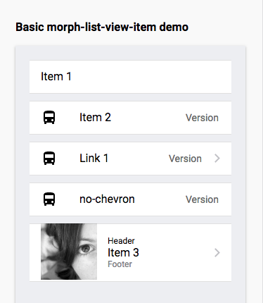
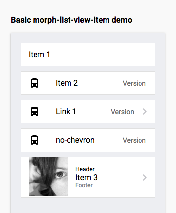
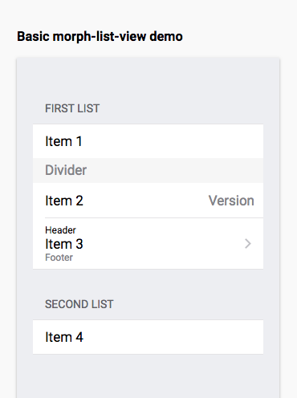
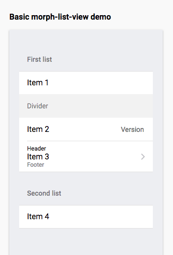

# morph-list-view-item
List view item component

## Getting Started:
For the information about how to clone the desired repository, running the local server and testing, please refer to this [link](https://github.com/moduware/polymorph-components/blob/master/INFO.md).

## Demo

- Here is a quick demo of the morph-list-view-item element for IOS platform.

  <p align="center">
    
  </p>

- Here is a quick demo of the morph-list-view-item element for Android platform.

  <p align="center">
    
  </p>

- Both IOS and Android demo are using the HTML markup. 

```html

<template>
  <morph-list-view-item>Item 1</morph-list-view-item>
  <morph-list-view-item>
    <span slot="icon"><iron-icon icon="maps:directions-bus"></iron-icon></span>
    Item 2
    <span slot="secondary-content">Version</span> 
  </morph-list-view-item>

  <morph-list-view-item href="#moduware" no-ripple>
    <span slot="icon"><iron-icon icon="maps:directions-bus"></iron-icon></span>
    Link 1
    <span slot="secondary-content">Version</span> 
  </morph-list-view-item>

  <morph-list-view-item href="#moduware" no-chevron>
    <span slot="icon"><iron-icon icon="maps:directions-bus"></iron-icon></span>
    no-chevron
    <span slot="secondary-content">Version</span> 
  </morph-list-view-item>
  <morph-list-view-item href="#moduware" contains-media>
    <span slot="icon">
      
    </span>
    <span slot="header">Header</span>
    Item 3
    <span slot="footer">Footer</span>
  </morph-list-view-item>
</template>

```

- Demo when morph-list-view-item is inside morph-list-view for IOS platform

  <p align="center">
    
  </p>

- Demo when morph-list-view-item is inside morph-list-view for IOS platform

  <p align="center">
    
  </p>

- Here's the HTML markup when morph-list-view-item is inside morph-list-view for both IOS and Android platform

```html

<template>
  <morph-list-view>
    <morph-list-view-title>First list</morph-list-view-title>
    <morph-list-view-item>Item 1</morph-list-view-item>

    <morph-list-view-divider>Divider</morph-list-view-divider>

    <morph-list-view-item>
      <!-- <span slot="icon"><iron-icon icon="maps:directions-bus"></iron-icon></span> -->
      Item 2
      <span slot="secondary-content">Version</span> 
    </morph-list-view-item>
    <morph-list-view-item href="#moduware">
      <span slot="header">Header</span>
      Item 3
      <span slot="footer">Footer</span>
    </morph-list-view-item>
  </morph-list-view>

  <morph-list-view>
    <morph-list-view-title>Second list</morph-list-view-title>
    <morph-list-view-item>Item 4</morph-list-view-item>
  </morph-list-view>
</template>

```

### Attributes

|     Custom Attribute    |   Type  | Description                                                                                   | Default        |
|:-----------------------:|:-------:|-----------------------------------------------------------------------------------------------|----------------|
|       **`href`**        | String  | Takes the value of the url. When **`href`** is present, the item becomes a link               | **no default** |
|    **`containsMedia`**  | Boolean | This is an option for items to take in media/images instead of just icons                     | **`false`**    |
|    **`noRipple`**       | Boolean | To have a list item with no ripple assign **`true`** or just set this on the the html markup  | **`false`**    |
|    **`noChevron`**      | Boolean | To have a list item with no chevron assign **`true`** or jsut set this on the the html markup | **`false`**    |

### Styling

- Custom CSS property

Custom property                    | Description                                                                      | Default    |
-----------------------------------|----------------------------------------------------------------------------------|------------|
`--display-top-line`               | Display property for item top line use to configure when on a list view          | 48px       |
`--display-inner-item-bottom-line` | Display property for item inner bottom line use to configure when on a list view | #0076FF    |
